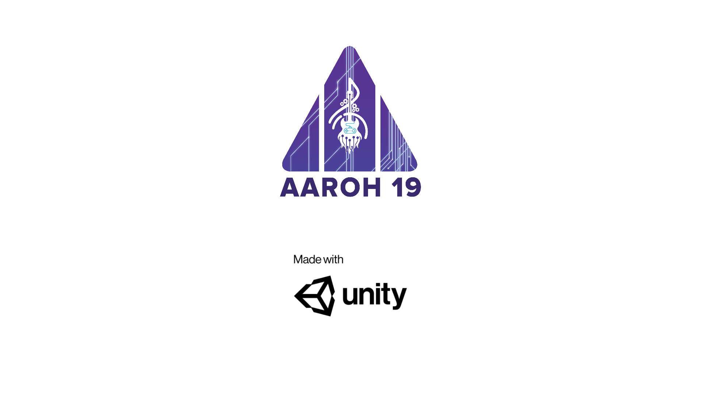

# AR-TreasureHunt-2.0

An Augmented Reality Treasure Hunt game Build using Unity and Vuforia

This is the source code for **AR Treasure Hunt** for **Aaroh19**, techno-cultural fest conducted at **College of Engineering Adoor** on *Apr 5, 6 & 7, 2019*.

Starter code and assets from https://github.com/fi-content2-games-platform/FIcontent.Gaming.Application.TreasureHunt

### N.B.
One of the scene requires phone with Gryscope sensor to work.
Remove it if you want as certain phones lack that sensor.

# Instructions 

1. Setup Vuforia Config
    1. Get api key from vuforia and add to vuforia config.
1. Add image targets
    1. Create your own image target database at vuforia
    1. Import them the database to your project
    1. Enable you own datasets for scenes
1. Customize clues in "clue#" scenes
1. Insert image targets in "scene#"
1. Add next "clue#" scene name to "scene#"
1. Duplicate "clue#" and "scene for as many levels you like 
1. Build apks

### References

- [Unity Manual](https://docs.unity3d.com/Manual/android-sdksetup.html)
- [Youtube](https://www.youtube.com/watch?v=MtiUx_szKbI)